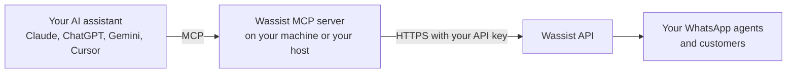

<p align="center">
  <picture>
    <source media="(prefers-color-scheme: dark)" srcset="assets/logo-full-dark.svg">
    
  </picture>
</p>

<h1 align="center">Wassist MCP server</h1>

[Wassist](https://wassist.app) runs AI agents on WhatsApp numbers. This MCP server lets an assistant such as Claude build those agents for you, end to end. You describe the business, and the assistant writes the agent's prompt and plugs it into your systems. It can wire up a team of agents that hand conversations to each other, test the result against simulated customers, and connect it to a real number when you are happy with it.

Setting that up by hand means learning the dashboard: API tool schemas, MCP connectors, handoffs, test personas, routing rules. Here the assistant does that part, and you stay in charge of anything that reaches a customer.

This is a community project, not an official Wassist release. It calls the public Wassist API at `https://backend.wassist.app/api/v1/` with your own API key. The Wassist name and logo belong to Wassist and appear here only to say which service this works with.

## How it works



The assistant decides which tool to call. This server checks the request, calls the Wassist API with your key, and hands back only what the task needs. Your key stays with you, in your client's secret store or on your own server.

## What you can ask for

- "I run a bakery. Build a WhatsApp agent that takes cake orders, answers questions from our price page, and hands complaints to a separate support agent."
- "Let the agent check order status with `GET https://api.mybakery.com/orders/{id}`. I'll add the API key in the dashboard."
- "Which MCP connectors do we have? Give the sales agent read-only HubSpot access."
- "Test the support agent against an angry customer whose order is late, and a customer who asks for something we don't sell. Fix whatever it gets wrong and test again."
- "Read yesterday's conversations and tell me where the agent answered badly."
- "Draft a template that says an order has shipped, then submit it to Meta for review."

## Install

You need Node.js 22 or newer and a Wassist API key from [Settings, Developers, API keys](https://wassist.app/settings/developers/api-keys/). Every option below asks for the key once and keeps it in your client's secret store.

### Claude Code

```bash
claude plugin marketplace add 1337Xcode/wassist-mcp-server
claude plugin install wassist@wassist-mcp-server
```

### Claude Desktop

Download the `.mcpb` file from the [latest release](https://github.com/1337Xcode/wassist-mcp-server/releases/latest) and open it.

### ChatGPT desktop and Codex

```bash
codex plugin marketplace add 1337Xcode/wassist-mcp-server
```

Then install Wassist from the plugin directory.

### Gemini CLI

```bash
gemini extensions install https://github.com/1337Xcode/wassist-mcp-server
```

### Cursor, VS Code, Windsurf and other local clients

Add this to the client's MCP settings:

```json
{
  "mcpServers": {
    "wassist": {
      "command": "npx",
      "args": ["-y", "github:1337Xcode/wassist-mcp-server"],
      "env": { "WASSIST_API_KEY": "your_key_here" }
    }
  }
}
```

This fetches the server straight from this GitHub repository, not from the npm registry, and builds it the first time it starts, which takes about a minute. If you would rather skip that, clone the repository and point the client at the ready-built server inside it. It needs nothing but Node.js:

```json
{
  "mcpServers": {
    "wassist": {
      "command": "node",
      "args": ["/path/to/wassist-mcp-server/plugins/wassist/server/index.mjs"],
      "env": { "WASSIST_API_KEY": "your_key_here" }
    }
  }
}
```

VS Code can ask for the key in a masked prompt instead of keeping it in the file, and [docs/clients.md](docs/clients.md) shows how.

### Claude.ai, ChatGPT on the web, and other web apps

Web apps connect from their own servers, so they can't reach `localhost`. The server needs an HTTPS address they can reach, and there are two ways to get one.

For regular use, run it on a server you control, behind HTTPS, with `npm run start:http`. Set `PUBLIC_URL` to its address and `OAUTH_SECRET` to a long random value. [docs/operations.md](docs/operations.md) covers the setup, including a reverse proxy.

For a quick try from your own machine, open a tunnel and pass its address to `npm run serve`:

```bash
cloudflared tunnel --url http://localhost:8080
npm run serve -- https://your-tunnel-address
```

Cloudflare's quick tunnels need no account. ngrok (`ngrok http 8080`) and similar tools work the same way.

Then add `https://your-address/mcp` as a custom connector and click Connect. A sign-in page opens where you paste your key once. Wassist has no sign-in of its own, so this server provides one: it checks your key with Wassist and gives the app an encrypted token that only your server can open.

If Claude offers a Request headers option when you add the connector, you can skip the sign-in page. Choose No sign-in and add an `x-api-key` header with your key.

[docs/clients.md](docs/clients.md) has step-by-step setup for each client and says which setups have been tested.

## Choose which tools load

Every tool an MCP server offers costs the model some context, whether it uses the tool or not. All 32 tools come to about 8,800 tokens. Two settings cut that down:

| Setting | Tools | About |
| --- | --- | --- |
| Everything (the default) | 32 | 8,800 tokens |
| `WASSIST_TOOLSETS=agents,testing`, for building and testing agents | 18 | 4,800 tokens |
| `WASSIST_READ_ONLY=true`, for looking around | 13 | 2,700 tokens |

The toolsets are `agents` (agents, their tools and connectors), `testing` (test chats and test runs), `whatsapp` (numbers, accounts and templates) and `conversations`. The guide tool is always on. Tools that are left out are never registered, so the model can't see or call them. In Claude you can also set each remaining tool to Always allow, Needs approval or Blocked, and Claude groups them into read-only and write tools for you.

## Tools

The server has 32 tools. 13 only read, and 19 change something.

### Agents and what they can use (`agents`)

| Tool | Kind | What it does |
| --- | --- | --- |
| `wassist_list_agents` | Read | Lists agents with their model and connected numbers |
| `wassist_get_agent` | Read | Shows an agent's prompt, first message, model and everything it can use, each with an id |
| `wassist_create_agent` | Create | Creates an agent from a name |
| `wassist_update_agent` | Update | Changes an agent's name, prompt, first message, icebreakers or model |
| `wassist_add_api_tool` | Create | Gives an agent one HTTP call into your own system, such as order status |
| `wassist_add_website_tool` | Create | Gives an agent a web page to read live, such as a price list |
| `wassist_add_agent_handoff` | Create | Lets an agent pass the conversation to another agent |
| `wassist_list_connectors` | Read | Lists your MCP connectors, or the public catalog you can add from |
| `wassist_set_agent_connector` | Update | Attaches an MCP connector to an agent and picks which of its tools it may use |
| `wassist_remove_agent_capability` | Update | Removes one of the above from an agent |

### Testing (`testing`)

| Tool | Kind | What it does |
| --- | --- | --- |
| `wassist_start_test_chat` | Create | Starts a test chat with an agent inside Wassist, with no phone involved |
| `wassist_send_test_message` | Sends | Says something to the agent in a test chat and waits for the answer |
| `wassist_read_test_chat` | Read | Reads a test chat back |
| `wassist_list_test_personas` | Read | Lists the simulated customers set up for an agent |
| `wassist_create_test_persona` | Create | Describes a simulated customer |
| `wassist_start_test_run` | Sends | Lets a persona talk to the agent for several turns in the background |
| `wassist_get_test_run` | Read | Shows a test run's progress and transcript |

### WhatsApp numbers and templates (`whatsapp`)

| Tool | Kind | What it does |
| --- | --- | --- |
| `wassist_list_phone_numbers` | Read | Lists WhatsApp numbers and where each one routes |
| `wassist_connect_agent_to_number` | Update | Makes an agent answer a number |
| `wassist_clear_number_routing` | Update | Stops a number from replying |
| `wassist_list_whatsapp_accounts` | Read | Lists linked WhatsApp Business Accounts |
| `wassist_create_whatsapp_link` | Create | Makes the link a person opens to connect a real WhatsApp number |
| `wassist_list_templates` | Read | Lists templates and their review status |
| `wassist_create_template` | Create | Creates a template draft |
| `wassist_update_template` | Update | Edits a template draft |
| `wassist_publish_template` | Sends | Submits a template to Meta for review |

### Conversations (`conversations`)

| Tool | Kind | What it does |
| --- | --- | --- |
| `wassist_list_conversations` | Read | Lists conversations with filters |
| `wassist_get_conversation` | Read | Shows one conversation, including the 24-hour reply window |
| `wassist_list_messages` | Read | Reads the messages in a conversation |
| `wassist_send_text_message` | Sends | Sends a free-form message to a customer |
| `wassist_send_template_message` | Sends | Sends an approved template to a customer |

### Always on

| Tool | Kind | What it does |
| --- | --- | --- |
| `wassist_guide` | Read | Short how-to guides the assistant can read mid-task |

[docs/tools.md](docs/tools.md) lists the inputs, limits and side effects of each tool. It is generated from the code, and a test fails if it goes stale. The plugins also ship a skill that teaches the assistant a safe order of steps.

## How agent tools are edited

Wassist stores an agent's API tools, web pages, handoffs and connectors as lists, and an update replaces the whole list. A careless edit would quietly delete tools, including auth headers that were added in the dashboard and never shown to the assistant.

So every change reads the agent first, writes back each existing entry exactly as Wassist sent it, touches only the one list it was asked to change, and then checks that nothing went missing. If something did, because someone edited the agent in the dashboard at the same moment, the tool says so and tells the assistant not to retry. [docs/architecture.md](docs/architecture.md#editing-an-agents-tool-lists) walks through it.

`wassist_add_api_tool` also takes no headers or secrets at all. When an endpoint needs a key, you add it in the dashboard, so it never passes through the chat.

## Trying an agent

You don't need a phone number to try an agent. A test chat works like the one in the dashboard, and the assistant can read the answers and adjust the prompt in a loop. Test runs go further: you describe a customer, such as someone angry about a late order, and Wassist plays that customer against the agent for several turns while the assistant reads the transcript.

Both run the agent for real, tools included. An agent with a tool that changes something in another system will change it during a test too.

Wassist does not let an API key route its shared sandbox number. To try an agent on WhatsApp, open the agent's `connectUrl` on the phone you signed in with, or connect your own number. `wassist_create_whatsapp_link` makes the link for that, and a person finishes Meta's sign-in in a browser. The number then shows up in `wassist_list_phone_numbers`.

## Configuration

| Variable | Used by | Default | Purpose |
| --- | --- | --- | --- |
| `WASSIST_API_KEY` | stdio | required | The Wassist API key |
| `WASSIST_READ_ONLY` | both | `false` | Hides every tool that changes data or sends messages |
| `WASSIST_TOOLSETS` | both | all | Loads only these toolsets, comma-separated: `agents`, `testing`, `whatsapp`, `conversations` |
| `PORT` | HTTP | `8080` | Port to listen on |
| `BIND_ADDRESS` | HTTP | `127.0.0.1` | Interface to listen on |
| `ALLOWED_HOSTS` | HTTP | none | Extra Host header names to accept, such as a tunnel domain |
| `PUBLIC_URL` | HTTP | none | Address clients use to reach the server. Turns on the sign-in page |
| `OAUTH_REDIRECT_HOSTS` | HTTP | any | Hosts that may receive sign-in codes, such as `claude.ai,claude.com`. Recommended for a public address |
| `OAUTH_SECRET` | HTTP | random | Keeps sign-ins valid across restarts. 32 or more characters |

For local runs, copy `.env.example` to `.env`. Git ignores that file. `npm run test:live` reads it, and your MCP client does not.

Set `WASSIST_READ_ONLY=true` to run the 13 read tools only.

## Is it safe to install?

Your Wassist key can act for your whole organization, so the server is built to be easy to check:

- It only talks to `backend.wassist.app`. That address is a constant, not a setting, and redirects are never followed. There is no telemetry.
- It never stores your key or writes it to logs, and never shows it to the model. API tool headers, webhook secrets and connector URLs are stripped from what the model sees.
- It has no delete tools, no raw API access and no tool that calls a URL you pass it. A write is never retried, so a message can't go out twice by accident.
- It runs on three runtime dependencies: the official MCP SDK and `zod`.
- Releases carry checksums and signed build provenance, so you can check that a download was built from this code.

[docs/security.md](docs/security.md) has the full model and the commands to verify each point yourself.

## Development

| Command | What it does |
| --- | --- |
| `npm run ci` | Lint, typecheck, find dead code, build and run all tests. No key or network needed |
| `npm test` | Build, then run the tests |
| `npm run test:live` | Run read-only checks against the real API using the key in `.env` |
| `npm run docs:tools` | Regenerate `docs/tools.md` from the tool definitions |
| `npm run build:mcpb` | Build and smoke-test the Claude Desktop extension |
| `npm run build:plugin` | Rebuild the server bundle that the plugin ships. A test fails when it is out of date |
| `npm run version:sync` | Copy the package version into the plugin and marketplace manifests, and rebuild the bundle |
| `npm run inspect` | Open the server in the MCP Inspector |

## Documentation

- [Connect your AI client](docs/clients.md)
- [Tool reference](docs/tools.md)
- [Architecture](docs/architecture.md)
- [Security model](docs/security.md)
- [Operations and releasing](docs/operations.md)
- [Wassist API notes and known conflicts](docs/wassist-api-notes.md)
- [Contributing](CONTRIBUTING.md)

## License

MIT. See [LICENSE](LICENSE).
