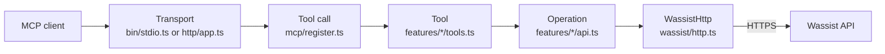

# Architecture

The server is one TypeScript package. A transport carries MCP messages, a feature folder holds everything about one Wassist resource, and a small client talks to the Wassist API. Dependencies point one way, so the client knows nothing about MCP and the transports know nothing about Wassist.

## Layout

```text
src/
  bin/stdio.ts            stdio entry point, reads WASSIST_API_KEY
  bin/http.ts             HTTP entry point, reads PORT and friends
  config.ts               environment parsing for both entry points
  server.ts               builds one McpServer and registers the tools it is given
  api.ts                  builds the API object from every feature's operations
  tools.ts                every tool in one fixed order, the toolsets, and selectTools
  logger.ts               JSON lines on stderr
  version.ts              package version
  features/<domain>/      one folder per Wassist resource, with api.ts and tools.ts
  wassist/                the plumbing for talking to Wassist: HTTP client, errors, paging
  mcp/                    the tool framework: defineTool, registration, error results, shared inputs
  http/                   the HTTP transport: guards, credentials, rate limit, body reading
  oauth/                  the optional sign-in: token sealing, endpoints, sign-in page
plugins/wassist/          the plugin for Claude Code, ChatGPT and Codex, with its skill
packaging/mcpb/           the manifest for the Claude Desktop extension
scripts/                  documentation, fixture, version and extension tooling
assets/                   logos and the app icon, and the Geist font the sign-in page serves
gemini-extension.json     the Gemini CLI extension, which runs the plugin's bundled server
tests/                    unit, contract, protocol, transport, security and packaging tests
docs/                     this documentation
```

## Where things live

The folders `features/` and `wassist/` look alike at first, so here is the difference. `wassist/` is how the server talks to Wassist in general. `features/` is what the server does with each Wassist resource.

| Folder | What it holds | What it may import |
| --- | --- | --- |
| `features/<domain>/api.ts` | The calls to one resource, such as `/phone-numbers/`, and the schemas for what comes back | `wassist/`, and another feature's `api.ts` when one resource shows another, as an agent shows its capabilities |
| `features/<domain>/tools.ts` | The MCP tools for that resource: names, descriptions, input schemas and what each one calls | `mcp/`, its own `api.ts`, and the type of the API object |
| `wassist/` | The HTTP client, error types, paging, and helpers that every resource shares | Only `version.ts`, for the User-Agent |
| `mcp/` | The tool framework, which knows nothing about individual resources | The type of the API object, `wassist/errors.ts` to describe failures, and the logger |

To change how phone numbers work, open `features/phone-numbers/`. The `api.ts` file there changes what is sent to Wassist and what is kept from the answer. The `tools.ts` file changes what the model sees. The domains are agents, agent capabilities, connectors, test chats, test runs, phone numbers, conversations, templates, WhatsApp accounts, and the guides, which answer from the server itself. Adding a resource means adding a folder with those two files, then listing it in `src/api.ts` and `src/tools.ts`.

## How a tool is defined

Every tool is one value with a fixed shape, created by `defineTool` in `src/mcp/tool.ts`:

- `name`, `title` and `description`, which the model reads
- `effect`, one of `read`, `create`, `update` or `external`
- `input` and `output`, both zod schemas
- `run`, a function that receives the validated input and returns the output

The `effect` field is the single source for two decisions. It maps to the MCP annotations that clients use for approval prompts (`readOnlyHint`, `destructiveHint`, `idempotentHint`, `openWorldHint`), and it decides whether read-only mode keeps the tool. Nothing else in the code branches on it.

A tool that finds a problem itself, such as an id that is not on the agent, throws a `ToolError` from `src/mcp/failures.ts` with a code and a message written for the model. Failures from Wassist arrive as `WassistApiError`. Both become the same kind of error result.

Each `tools.ts` exports an array of its tools. `src/tools.ts` places each array in exactly one toolset (`agents`, `testing`, `whatsapp` or `conversations`) and keeps every tool in one fixed order, so clients can cache the list. At startup, `selectTools` applies `WASSIST_TOOLSETS` and `WASSIST_READ_ONLY` once, and `src/mcp/register.ts` registers only what it returns. A tool that is left out is never registered, so no client can list it or call it.

## How a request flows



Each step only knows the one after it. A read call such as `wassist_list_conversations` travels like this:

1. The transport hands the JSON-RPC request to the MCP SDK, which validates the arguments against the tool's input schema and rejects anything unexpected.
2. The handler in `src/mcp/register.ts` calls the tool's `run` with the API and the request's abort signal.
3. The tool calls an operation from its own folder, here `api.conversations.list` from `features/conversations/api.ts`.
4. The operation asks `WassistHttp` for `GET /api/v1/conversations/`. That class builds the URL on the pinned Wassist origin, adds the API key, sends the request without following redirects, and reads the body with a size cap.
5. The body is parsed and validated with a zod schema. Only fields the tool needs survive, which is where agent tool credentials and webhook secrets are dropped.
6. The operation maps the result to a domain shape and a page, and the handler returns it as JSON text plus structured content.

A write call such as `wassist_send_text_message` follows the same path with three differences. The request is sent once and never retried. A timeout or server error is reported with `outcomeUnknown` so the caller checks state before trying again. A rejected request may carry a tool-specific hint, such as the template suggestion for a closed 24-hour window.

## The Wassist client

`src/wassist/http.ts` owns everything about talking to the API: the pinned origin, the key header, the 30 second timeout, the 2 MiB response cap, error translation, and retries. Only `GET` requests retry, up to three attempts, on `429`, `502`, `503`, `504` and network errors. A `Retry-After` longer than ten seconds is reported instead of waited for.

Each `api.ts` holds two kinds of schema. The raw one is forgiving about `null` and missing fields, because the live API returns both, and it leaves out anything the tools must not show. The exported one is strict, and clients see it as the tool's output schema.

List endpoints answer with either a bare array or a `{ count, next, results }` envelope, and the two sources of truth disagree about which endpoint uses which. `src/wassist/list.ts` accepts both. `fetchPage` is for endpoints where Wassist applies the limit and offset, and `fetchAll` is for endpoints that return everything and get cut to a page locally. Both produce one page shape with `items`, `total` and `nextOffset`. `fetchList` returns a whole list for a lookup, such as finding one connector by id. See [Wassist API notes](wassist-api-notes.md).

## Editing an agent's tool lists

An agent's API tools, web pages, handoffs and MCP connectors are lists on the agent, and Wassist's `PATCH` replaces a list whole. Entries sent with an `id` are kept or updated, entries without one are created, and anything left out is deleted. That makes a naive edit dangerous, because a tool built from what the model saw would drop fields the model never saw, such as an auth header added in the dashboard.

`features/capabilities` handles this in three steps:

1. `read` fetches the agent and keeps each entry exactly as Wassist sent it, using a loose schema that preserves every field.
2. The tool decides the new list: the stored entries unchanged, plus one new entry or minus one id. `write` sends that one list and nothing else, so the prompt and the other lists are never part of the request.
3. After the write, the tool checks that every entry it kept is still there. Wassist offers no conditional update, so an edit made in the dashboard between the read and the write could be lost. When that happens the tool reports a `conflict` and tells the model not to retry, because the write already went through.

The readable view that tools return comes from a separate strict schema that never parses an API tool's `apiSchema`, so fixed values such as keys stay on the server.

## Changing things safely

Most changes touch one folder, and a test fails if the change leaves something else behind.

| To change | Edit | What catches a mistake |
| --- | --- | --- |
| What a tool returns, or a field Wassist renamed | The raw and exported schemas in that feature's `api.ts` | The feature's tests in `tests/tools`, and `invalid_response` errors naming the field |
| A tool's wording or inputs | That feature's `tools.ts`, then `npm run docs:tools` | `tests/docs/tools-doc.test.ts` fails until `docs/tools.md` is regenerated |
| Add a tool | `api.ts` and `tools.ts` in its feature, then its toolset in `src/tools.ts` | The catalog, contract, README and skill tests each fail until the tool is listed, called and documented |
| Which tools a toolset holds | `TOOLSETS` in `src/tools.ts`, and the matching table in the README | `tests/docs/readme.test.ts` compares each README table with its toolset |
| A limit, such as a timeout or a list cap | The named constant at the top of the file that uses it | The tests in `tests/wassist` and `tests/tools` that assert the limits |
| Wassist changed an endpoint | Run `npm run fixtures:openapi`, then fix the feature's `api.ts` | `tests/contract/openapi.test.ts` flags requests the official file no longer declares |
| The sign-in page | `src/oauth/pages.ts` | `tests/oauth/pages.test.ts`, including the check that its one script matches the hash the page allows |

When a tool fails for a user, the log line on stderr has the tool name, the error code, the HTTP status and Wassist's request ID, and never the arguments. The request ID is what Wassist support needs.

## Transports

The stdio entry point reads one key from the environment and serves it for the life of the process. The MCP SDK picks the protocol revision from the client's first message, so clients that speak the 2025 handshake and clients that speak 2026-07-28 both work from the same server factory.

The HTTP entry point builds a new server for every request. The request's credential becomes the `authInfo` handed to the SDK, the factory reads it back, and a `WassistHttp` bound to that key is created for that request only. Nothing is shared between callers except the rate limiter, which stores a hash of each key.

When `PUBLIC_URL` is set, `src/oauth` adds an authorization server to the same process. It serves the discovery documents, client registration, the sign-in page with its font, and the token endpoint. The page allows one script, the show-key button, by its hash in the content security policy, and nothing else. `src/http/app.ts` routes those paths to it and asks it to turn a bearer token into a Wassist key. Anything that is not one of its own tokens passes through as a raw key, so both kinds of caller share one code path after that. The tokens are sealed payloads, so the server keeps no store. Details of the guards and the sign-in are in [Security model](security.md).

## Distribution

Every way to install the server takes it from this GitHub repository. Nothing is published to the npm registry, and `package.json` is marked private so it can't be by accident. A test keeps the manifests in step with `package.json`.

- `plugins/wassist` is a plugin folder that both Claude Code and OpenAI's plugin hosts read. It holds the two manifests, the skill, the icon and `server/index.mjs`, a bundled copy of the server. The plugin runs that file with `node`, so installing it needs no npm and no build. `npm run build:plugin` regenerates the bundle, and a test fails when it no longer matches `src`. The repository root carries the marketplace files that point at the folder.
- `packaging/mcpb` holds the template for the Claude Desktop extension. `scripts/build-mcpb.mjs` bundles the server, adds the tool list from the code, smoke-tests it and packs it. The release workflow attaches the result to each GitHub release.
- `gemini-extension.json` at the root lets Gemini CLI install the repository and run the same bundled server.
- The repository itself runs with `npx -y github:1337Xcode/wassist-mcp-server`, which downloads it from GitHub. The `prepare` script builds `dist` during that install. A clone works too: `node plugins/wassist/server/index.mjs` runs the bundle with no install step.

Both bundles come from `scripts/lib/bundle.mjs`, so they contain the same code.

## Testing approach

Tests call the server the way a client does, through a real MCP client, and assert exact results and exact upstream requests. A fake Wassist API replaces the network, and it fails on any request nobody described. The suites cover:

- `tests/wassist` for the HTTP client, retries, error translation and redaction
- `tests/tools` for every tool through the protocol, in both protocol eras
- `tests/contract` for a check that every request matches the official OpenAPI operations, kept as a fixture
- `tests/transport` for a spawned stdio process and a real HTTP server
- `tests/oauth` for token sealing, every sign-in rule, token lifetimes with a fake clock, and a full sign-in by the MCP SDK's OAuth client
- `tests/security` for credential handling and log content
- `tests/packaging` for the manifests, the skill and the configuration names they share
- `tests/docs` for checks that `docs/tools.md` matches the code and that every top-level declaration in `src` has a comment
- `tests/live` for read-only checks against the real API, run only with `npm run test:live`
