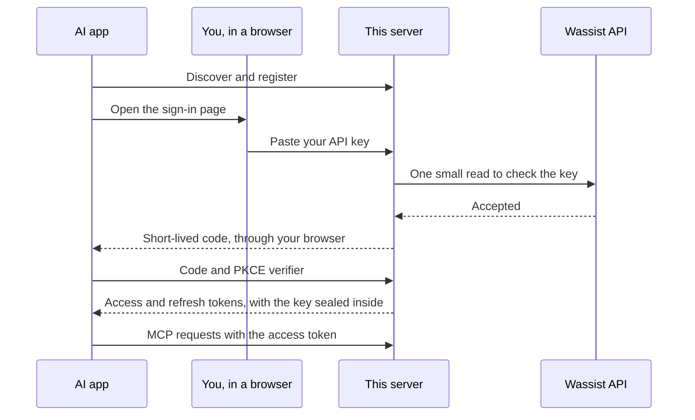

# Security model

A Wassist API key acts for a whole organization. It can read every conversation, change every agent and message every customer, and the API reference documents no way to narrow it. The server treats the key as high privilege and limits what it does with it.

## At a glance

| Question | Answer |
| --- | --- |
| Where does it send data? | Only to `https://backend.wassist.app`. The address is a constant in `src/wassist/http.ts`, not a setting, and redirects are never followed. There is no telemetry, analytics or update check. |
| Where does my key live? | Locally, in your client's secret store or environment. Over HTTP, in each request, or sealed inside a token that only your server can open. It is never written to disk or logs. |
| What does the model see? | Only the fields a task needs. API tool headers, webhook secrets, connector URLs and tool arguments are dropped before a result is built. |
| What can it change? | Only what its tools name, one tool per action. There are no delete tools, no raw API passthrough and no tool that takes a URL to call. |
| Can I limit it? | `WASSIST_READ_ONLY=true` removes every write tool. `WASSIST_TOOLSETS` loads only the groups you pick. Clients such as Claude let you block single tools as well. |
| What does it run? | TypeScript on Node.js with three runtime dependencies: the official MCP SDK (`@modelcontextprotocol/server` and `@modelcontextprotocol/node`) and `zod`. With what they pull in, that is six packages. |
| Is what I download what is in the repository? | Each release lists the SHA-256 checksum of the desktop extension. It and the plugin bundle also carry a signed statement that GitHub Actions built them from this repository. |

## Check it yourself

You don't have to take the table above on trust.

```bash
# The only host the server can call, and where the key is used.
grep -rn "backend.wassist.app\|X-API-Key" src

# Every package that runs in production, and any known vulnerabilities.
npm ls --omit=dev --all
npm audit --omit=dev

# Check a downloaded release file against its checksum and its signed build provenance.
sha256sum -c SHA256SUMS
gh attestation verify wassist-mcp-server-0.1.0.mcpb --repo 1337Xcode/wassist-mcp-server

# Start it with no way to change anything, and look at the tools in the MCP Inspector.
WASSIST_READ_ONLY=true npm run inspect
```

The test suite checks the same claims on every change: `tests/security` for keys and logs, `tests/wassist` for the fixed origin and redirects, and `tests/tools/catalog.test.ts` for read-only mode and toolsets.

## Credentials

On stdio the key comes from `WASSIST_API_KEY`, which your MCP client passes to the process. The server validates it at startup and exits with a clear message if it is missing or malformed. The error never echoes the value.

On HTTP the server has no key of its own. Each request carries the caller's credential, which is either a Wassist key in `X-API-Key` or an `Authorization: Bearer` header, or an access token from the optional sign-in page described below. The server builds a fresh server instance for that request, uses the key for that request's Wassist calls, and discards it. Two organizations calling at the same moment never share a key or any other state.

A credential in the URL is never read, because URLs end up in logs, proxies and browser history. No tool accepts a key as an argument, and a test fails if one ever does.

Apart from sitting in memory while a request runs, the key is written to one place: the `X-API-Key` header sent to `backend.wassist.app`. It is never logged. Error messages that come from Wassist are scanned and any copy of the key is replaced with `[redacted]`.

## Sign-in page for web apps

Claude.ai, ChatGPT and Perplexity cannot send a static key from their normal connector screens, and they expect OAuth. Wassist offers no OAuth of its own, so setting `PUBLIC_URL` turns on a small authorization server inside the HTTP server. It follows the MCP authorization spec: protected resource metadata, authorization server metadata, dynamic client registration, PKCE with S256, and the `resource` and `iss` parameters. The MCP SDK's own OAuth client completes the whole flow in the test suite.

How it works:



1. The app discovers the server, registers itself, and sends the user to `/oauth/authorize`.
2. The page names the app and asks for a Wassist API key.
3. The server checks the key with one small read against Wassist. Only a key that Wassist accepts gets past this step.
4. The server hands the app a short-lived code. The app exchanges it, with its PKCE verifier, for an access token and a refresh token.

What it stores: a short in-memory list of used code IDs, and the current generation of each refresh token family, described below. Nothing else. Every token is a sealed payload, encrypted and authenticated with AES-256-GCM under a key derived from `OAUTH_SECRET`. The purpose of each token is part of what is authenticated, so a refresh token cannot be used as an access token, and the reverse. The Wassist key travels inside the access and refresh tokens, where the server can open it and nobody else can.

| Item | Lifetime |
| --- | --- |
| Authorization request on the page | 10 minutes |
| Authorization code | 60 seconds, single use |
| Access token | 1 hour |
| Refresh token | 30 days, single use, replaced at each refresh |
| Client registration | 90 days |

Rules the server enforces:

- Redirect URIs must use https, or http on localhost, with no credentials or fragment. The URI at `/oauth/authorize` must match one registered URI exactly. An unknown client or an unregistered URI gets an error page and never a redirect.
- PKCE with S256 is required, and the verifier is compared in constant time.
- A `resource` value must be this server.
- The page cannot be framed or cached, its form can only post back to this server and redirect to the app's own callback origin, and every value it shows is escaped. The only value from the request that it shows is the app's name. It runs one script, the show-key button, which the content security policy allows by its SHA-256 hash, so no other script can run even if one got into the page. It loads its font from this server and nothing from anywhere else. The link for creating a key is a constant. The redirect origin has to be in the policy because Chrome checks a form's redirect against `form-action`. A stricter `form-action 'self'` silently blocked the trip back to the app in an earlier build. Its referrer policy is `same-origin`. `no-referrer` looks stricter but makes browsers send `Origin: null` on the form POST, which the origin check rightly rejects, and that was a real bug in an earlier build.
- `OAUTH_REDIRECT_HOSTS` limits which https hosts can receive a sign-in code. Localhost callbacks stay allowed, because a code sent there only reaches the user's own machine. The list is checked when an app registers and again when it asks to sign in, so it also covers apps registered before the list was set.
- Refresh tokens rotate. Each sign-in starts a family, and every refresh retires the token it used and issues the next generation. If a retired token comes back, someone has a copy, so the whole family is revoked and the user signs in again. This is the replay detection OAuth 2.1 asks for with public clients.
- The sign-in and token endpoints are rate limited, and the key field is never echoed back.
- Tokens are never logged.

Limits to know about:

- Access cannot be revoked one token at a time. Delete the API key in Wassist, or change `OAUTH_SECRET`, to cut off every sign-in. An access token stays valid for the rest of its hour after its family is revoked, because access tokens are checked without any stored state.
- Refresh token families live in memory. After a restart, the first refresh token presented for a family is accepted and tracking starts again from there, so a copy made before the restart could win that race once.
- Registration is open by default, as the spec allows for public clients. Anyone who can reach the server can register an app with a callback they control and send you a sign-in link. The page shows who is asking and where access goes, and a key is only sent if you type it, but a careless click could hand a code to the wrong host. Set `OAUTH_REDIRECT_HOSTS` to the hosts of the apps you use, such as `claude.ai,claude.com`, and this attack is closed. Run the server for yourself or your team, and do not publish an open instance.
- If `OAUTH_SECRET` is not set, the server makes a random one at startup and every sign-in ends when it restarts. It logs a warning when that happens.
- Sign-ins identify a Wassist key, not a person. Everyone who signs in with the same key is the same caller.

## Where requests can go

`WassistHttp` builds every URL on the fixed origin `https://backend.wassist.app`. The origin is a constant, not a setting, and tools cannot supply a URL, a host or a path. Path segments are percent-encoded. Redirects are never followed, so a redirect cannot carry the key to another host. The OpenAPI contract test checks that every request the tools make is an operation Wassist declares.

## What comes back to the model

Results contain only the fields a workflow needs.

- Agent tool definitions can include credentials, such as an `Authorization` header for the customer's own API. `wassist_get_agent` and the capability tools return each tool's id, name, description and switch, never the tool schema, request headers or outbound trigger secrets.
- Connector URLs can carry a token, so `wassist_list_connectors` shows only the host.
- Message tool executions are reduced to the tool name, type, error and duration. Arguments and results are dropped because they can hold customer data.
- Last-message previews are cut to 200 characters and message text to 2000.
- Error results contain a code, a short message, and the status and request ID. Raw upstream bodies and stack traces are never included, and a server error body is not passed on at all.

Messages, names and phone numbers come from customers and can contain instructions aimed at the assistant. The read tools say so in their descriptions and in the server instructions. The server cannot enforce how a model treats that text, so a client that lets a model read customer messages and also call write tools should keep its approval prompts on.

## Writes

Tools that send messages or change routing affect real people, so writes follow stricter rules than reads.

- A write is sent once. It is never retried, because the API reference documents no idempotency mechanism for the calls this server makes. If a write times out or Wassist answers with a server error, the result says `outcomeUnknown` and tells the caller to check state with a read tool first.
- Nothing substitutes one action for another. When a free-form message is rejected, the error explains the 24-hour window and suggests `wassist_send_template_message`, and no template is sent.
- `wassist_update_agent` only accepts plain fields. The API replaces tool lists such as `tools` and `handoffTools` as a whole and deletes anything left out, so those lists are changed only by the capability tools, which write back every existing entry unchanged and check the result. [Architecture](architecture.md#editing-an-agents-tool-lists) has the details.
- `wassist_add_api_tool` takes no headers. An endpoint that needs a key gets it from the person, in the Wassist dashboard, so a third party's secret never passes through the model or the chat history. Later edits through this server keep that header, because existing entries are written back as they came.
- `wassist_set_agent_connector` only attaches a connector the organization has already connected, and only tools that connector offers. Connecting a new MCP server usually needs a sign-in with that service, which a person does in the dashboard.
- `applyToExisting` on routing tools is required. The default upstream is not documented, and it decides whether running conversations are restarted, so the caller has to choose.
- Every input is validated with a strict schema. Unknown fields, IDs that are not UUIDs, phone numbers that are not E.164 and oversized text are rejected before any request is made.

MCP annotations such as `destructiveHint` are hints that help clients show approval prompts. Claude, for example, sorts a connector's tools into read-only and write groups from them, so a user can allow every read at once and keep approving writes one by one. That is also why reads and writes are never combined in one tool. The annotations are not authorization. The controls that hold without any client cooperation are read-only mode and toolsets, which leave tools unregistered, and the input schemas.

## HTTP transport

The HTTP server is meant to sit behind a TLS terminator or tunnel, and it applies these checks itself:

| Check | Behavior |
| --- | --- |
| Bind address | Loopback by default. Binding to every interface logs a warning. |
| Host header | Must be loopback, the host of `PUBLIC_URL`, or listed in `ALLOWED_HOSTS`, which blocks DNS rebinding. |
| Origin header | Absent is fine for non-browser clients. When present it must be loopback or an allowed host. |
| Credentials | A valid key or access token is required, or the answer is `401` with a pointer to the sign-in when it is on. |
| Body | JSON or form data only, at most 1 MiB for MCP and 16 KiB for the sign-in endpoints, read with a running byte count. |
| Rate | 120 requests per minute per key on `/mcp`, kept in memory as a hash of the key. |
| Timeouts | 20 seconds for headers and 120 seconds for a request. |

A `401` here means the caller sent nothing usable. Wassist decides whether a key is valid when the first tool runs, and a bad key produces an `unauthorized` tool error. The sign-in page checks the key with Wassist before it issues anything.

## Logging

Logs are JSON lines on stderr. They record startup, rejected requests, and tool failures with the tool name, error code, status and request ID. They never contain tool arguments, message text, phone numbers, keys, tokens or responses, and a test checks that.

## Supply chain

Dependencies are pinned to exact versions, with a minimum age of a week at the time they were added, and `npm audit` runs in CI. The GitHub Actions workflow pins every action to a commit. The desktop extension and the plugin bundle are built from the same code by one script, and the extension build smoke-tests the bundle before it packs it.

## Known limits

- The key is organization-wide. The server cannot restrict a key that Wassist does not restrict, and read-only mode is the narrowest setting it offers.
- HTTP mode does not identify individual users. Everyone who holds the same key is the same caller.
- The rate limiters, the used-code list and the refresh token families live in one process. A deployment with several processes should limit at the proxy as well, and a code or a retired refresh token could be used once per process.
- Apps register with the sign-in page through dynamic client registration. The 2026-07-28 MCP specification deprecates that in favor of client ID metadata documents, with at least a year of overlap. Supporting those would mean this server fetching addresses that apps name, so it waits until clients need it.
- Editing an agent's tool lists is read, then write, because Wassist offers no conditional update. A change made in the dashboard at the same moment can be lost. The tools detect a lost entry after the fact and report it, but cannot prevent it.
- TLS is not terminated by the server. Use a proxy or tunnel that provides HTTPS.
